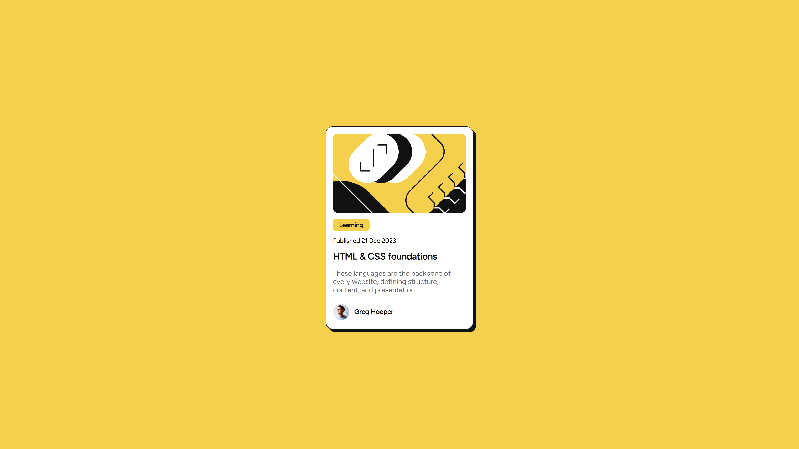

# Frontend Mentor - Blog preview card solution

This is a solution to the [Blog preview card challenge on Frontend Mentor](https://www.frontendmentor.io/challenges/blog-preview-card-ckPaj01IcS). Frontend Mentor challenges help you improve your coding skills by building realistic projects. 

## Table of contents

- [Overview](#overview)
  - [The challenge](#the-challenge)
  - [Screenshot](#screenshot)
  - [Links](#links)
- [My process](#my-process)
  - [Built with](#built-with)
  - [What I learned](#what-i-learned)
  - [Continued development](#continued-development)
  - [Useful resources](#useful-resources)
  - [AI Collaboration](#ai-collaboration)
- [Author](#author)
- [Acknowledgments](#acknowledgments)

**Note: Delete this note and update the table of contents based on what sections you keep.**

## Overview

### The challenge

Users should be able to:

- See hover and focus states for all interactive elements on the page

### Screenshot



### Links

- Solution URL: [Add solution URL here](https://github.com/ProMij2006/ProMij-blog-preview)
- Live Site URL: [Add live site URL here](https://promij2006.github.io/ProMij-blog-preview/)

## My process

### Built with

- Semantic HTML5 markup
- CSS custom properties
- Flexbox

### What I learned

Learned how to name tags

```html
<main class="blog-card">
    <div class="blog-card__image-container">
      
    </div>
    <div class="blog-card__content">
      <p class="blog-card__status">Learning</p>
      <p class="blog-card__date">Published 21 Dec 2023</p>
      <h1 class="blog-card__title">HTML & CSS foundations</h1>
      <p class="blog-card__description">These languages are the backbone of every website, defining structure, content, and presentation.</p>
    </div>
    <div class="blog-card__bio">
      
      <p class="blog-card__name">Greg Hooper</p>
    </div>
  </main>
```

Learned how to set css style to default for browser.

```css
* ::before, * ::after {
    box-sizing: border-box;
    margin: 0;
    padding: 0;
}
```

### Continued development

In future I want to learned about certain tags in html. How diffent research engine like google or different browsers work with websites.

### AI Collaboration

I used gemini for generating code. Gemini helps me to generate default boilerplate. Also i had asking him about diffent css methods and how to name tags in class right.

## Author

- Website - [ProMij2006](#none)
- Frontend Mentor - [@ProMij2006](https://www.frontendmentor.io/profile/yourusername)
